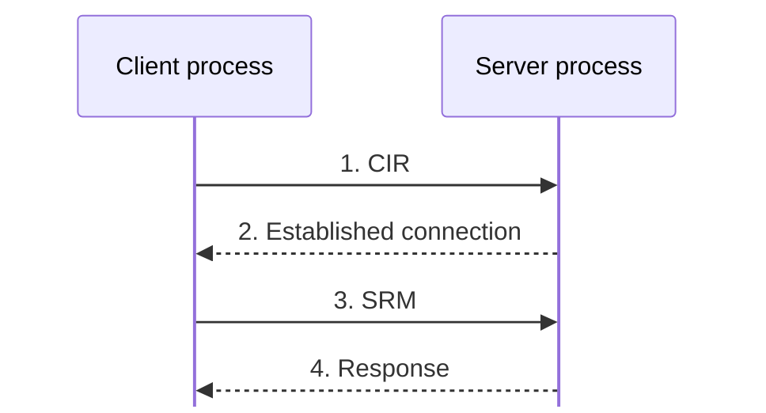
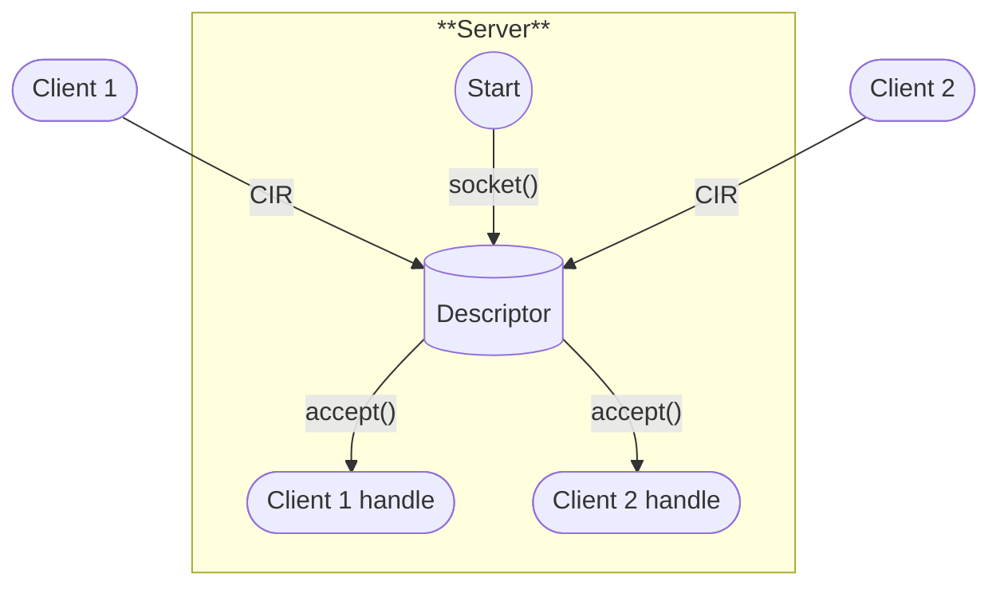
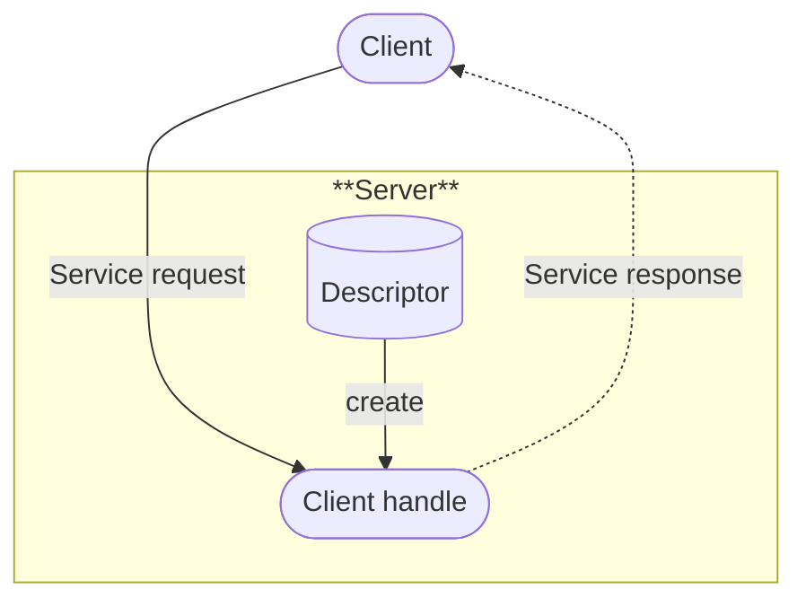
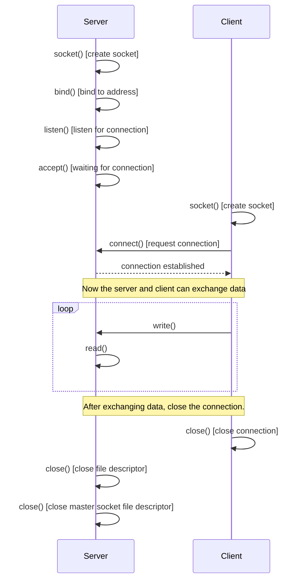

## 1. What is IPC?

IPC (Inter Process Communication) is a mechanism through which two or more processes running on the same machine exchange data with each other.
Communication between processes running on different machines is not considered IPC.

Linux OS provides several mechanisms for user-space processes to communicate with each other, each with its own pros and cons.
IPC techniques map well to other platforms, such as Windows and MacOS, and are conceptually the same.

IPC Techniques:
- Unix domain sockets.
- Message queues.
- Shared memory.
- Signals.
- Network sockets (Not covered in this article).
- Pipes (Not covered in this article).

## 2. Unix domain sockets

### 2.1. Sockets introduction

![light mode only][img_1]{: width="253" height="131" .right .light .shadow }
![dark mode only][img_1d]{: width="253" height="131" .right .dark .shadow }
Linux provides a set of APIs called **System Calls** that applications can invoke to interact with the underlying OS. Socket APIs serve as the interface between applications and the OS. Using these APIs, applications instruct the OS to provide its services.

### 2.2. Socket message types

Messages (or requests) exchanged between the client and server processes can be categorized into two types:
1. Connection initiation request (CIR) messages: Used by the client to request the server to establish a connection.
2. Service request messages (SRM): Sent by the client once the connection is fully established. SRMs are used by the client to request the server to provide a service.

### 2.3. Socket design

State machine of socket-based client-server communication:
- When the server starts using the `socket()` API, it creates a connection socket (also called the "master socket file descriptor").
- The master socket file descriptor (referred to as "Descriptor") is the parent of all client handles. "Descriptor" creates (or "spawns") all client handles, which are also called "data sockets."

- Once client handles are created for each client using the `accept()` API, the server carries out communication (actual data exchange) with the client using these client handles, not the master socket (Descriptor).
- The server must maintain a database of connected client handles or data sockets. The master socket (Descriptor) is only used to create new client handles and is not involved in data exchange with already connected clients.

- In Linux terminology, client handles are called "communication file descriptors" or "data sockets," and "Descriptor" is called the "master socket file descriptor" or "connection socket".
- All socket descriptors are just integers assigned by the OS, starting from 3 (because 0, 1, and 2 are reserved for `stdin`, `stdout`, and `stderr`).

### 2.4. Unix domain socket introduction

Unix Domain Sockets are used for IPC between two or more processes running on the **same** machine. 
Using Unix Domain Sockets, we can set up STREAM or DGRAM based communication:
- STREAM: Used for connection-oriented communication, which ensures a continuous, reliable flow of data, similar to TCP. It is ideal for large data transfers, such as when moving or copying large files.
- DGRAM: Used for connectionless communication, similar to UDP, where small, independent units of data (datagrams) are transferred without establishing a persistent connection.

 | **Feature**           | **Connection-Oriented**                      | **Connectionless**                    |
 | --------------------- | -------------------------------------------- | ------------------------------------- |
 | API used              | `accept()`                                   | Not used                              |
 | Setup steps           | `socket()`, `bind()`, `listen()`, `accept()` | `socket()`, `bind()`, `recvfrom()`    |
 | Persistent connection | Yes                                          | No                                    |
 | Data exchange         | After connection is established              | Data sent/received without connection |
 | Protocol examples     | TCP (Network), Unix domain STREAM            | UDP (Network), Unix domain DGRAM      |

This is the sequence of API calls for STREAM-based communication Server/Client using Unix Domain Sockets:

### 2.5. Concept of multiplexing

Multiplexing is a mechanism, which the server can monitor multiple clients at the same time.

### 2.6. FAQ

Question: Does Unix Domain IPC work between a server and a client implemented in different programming languages?

Answer: Yes, Unix Domain Sockets allow IPC between applications written in different programming languages. Since Unix Domain Sockets are an IPC mechanism provided by the Linux kernel for user-space, the applications communicating via this mechanism can be implemented in any language, not just C. 

However, two important aspects must be ensured:
- Data Format: Both sides must agree on a common data format to handle data serialization and deserialization.
- Permissions: Unix Domain Sockets create a file in the filesystem for communication. Both the server and client need the correct permissions to access this socket file.

[//]: # (----------SCOPE OF DECLARATION OF LIST OF IMAGES USED IN POST----------)
[img_1]: /assets/img/2024-10-IPC-in-Linux/01_computer_layer_architecture.png "Computer Layer Architecture"
[img_1d]: /assets/img/2024-10-IPC-in-Linux/01d_computer_layer_architecture.png "Computer Layer Architecture"

> This article is not complete yet.
{: .prompt-warning }
